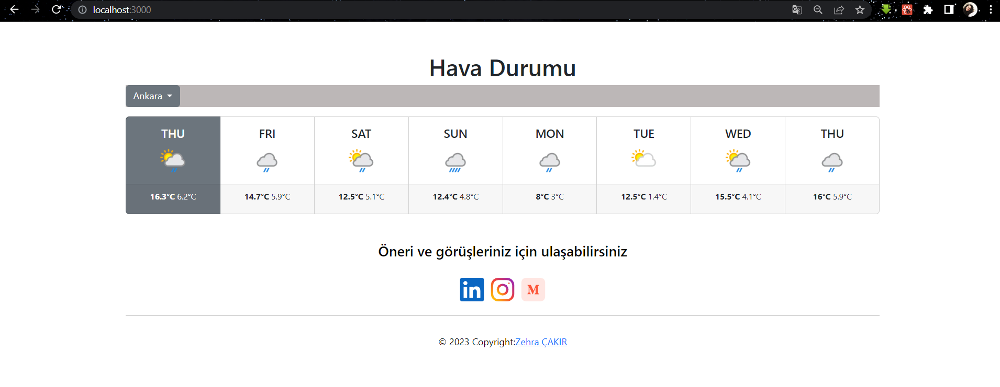
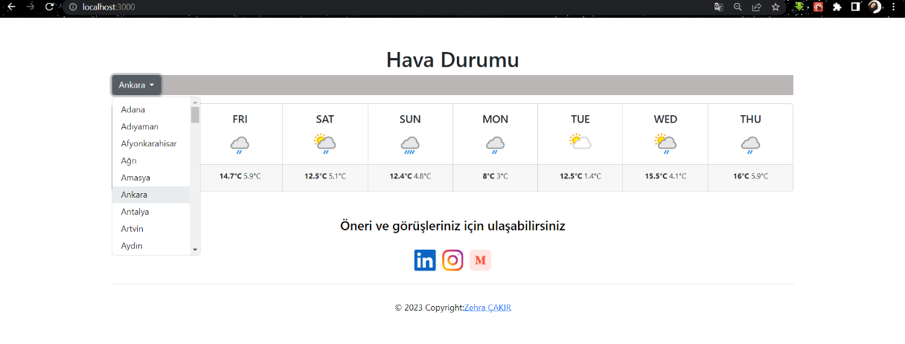

# React Ile Hava Durumu Sitesi

- Axios ile [weatherapi.com](https://www.weatherapi.com/docs/) dan hava durumu verilerini aldım.
- React Context ile statelerimi yönettim.
- Görünüm için React-Bootstrap’ten faydalandım.



Dropdown ile istediğimiz şehri seçebiliyor ve hava durumuna ulaşabiliyoruz.



- [Uygulamanın online çalışan versiyonunu incelemek için tıklayınız](https://weatherappwithreact.zehracakir.repl.co/)
- İsterseniz bu repository indirip de deneyebilirsiniz. Aşağıdaki bağımlılıkları ekledikten sonra projeyi çalıştırmak için **npm start** demeniz yeterli.

### React’a ek olarak proje klasörüne indirdiğim bağımlılıklar

```
npm install axios
```

```
npm install mdb-react-ui-kit
```

```
npm install react-bootstrap
```